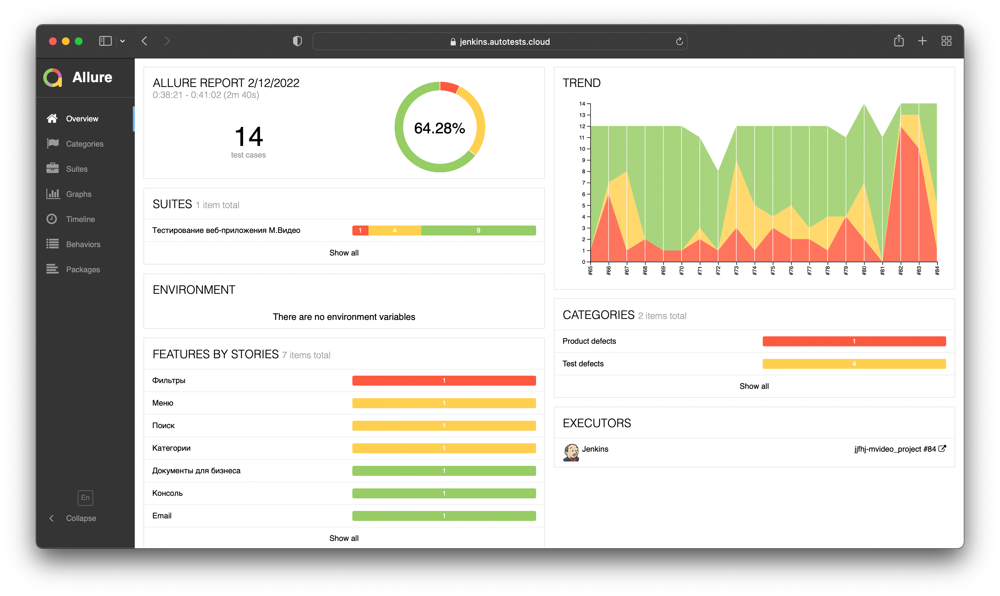
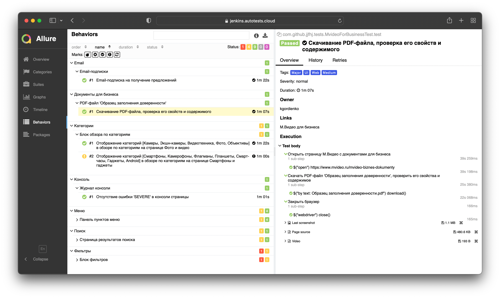
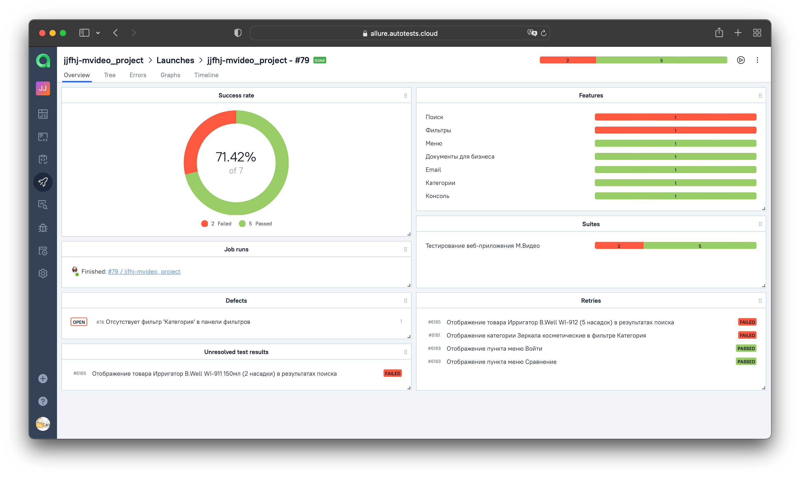
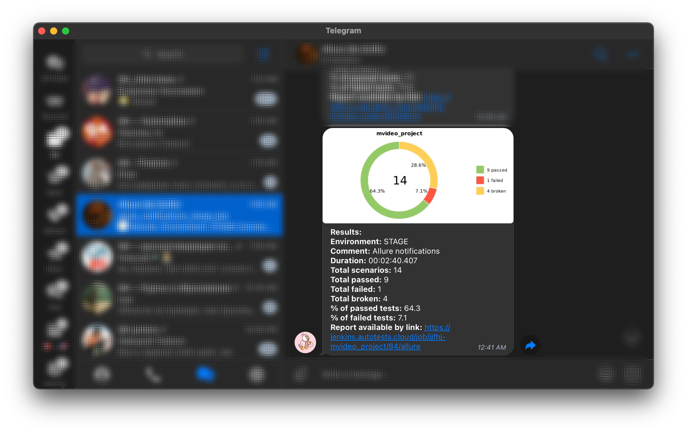

# Проект по автоматизации тестирования веб-приложения [М.Видео](https://www.mvideo.ru/)

<p align="center">

</p>

##  Содержание

> ➠ [Покрытый функционал](#-покрытый-функционал)
>
> ➠ [Технологический стек](#-технологический-стек)
>
> ➠ [Запуск тестов из терминала](#-запуск-тестов-из-терминала)
>
> ➠ [Запуск тестов в Jenkins](#-запуск-тестов-в-jenkins)
>
> ➠ [Отчет о результатах тестирования в Allure Report](#-отчет-о-результатах-тестирования-в-allure-report)
>
> ➠ [Интеграция тестов c тест-менеджмент системой Allure TestOps](#-интеграция-тестов-c-тест-менеджмент-системой-allure-testops)
>
> ➠ [Интеграция тестов c таск-трекер системой Jira](#-интеграция-тестов-c-таск-трекер-системой-jira)
>
> ➠ [Уведомления в Telegram с использованием бота](#-уведомления-в-telegram-с-использованием-бота)
>
> ➠ [Пример запуска теста в Selenoid](#-пример-запуска-теста-в-selenoid)

##  Покрытый функционал

> Разработаны автотесты на <code>UI</code>.

### UI

- [x] Отображение искомых товаров на странице результатов поиска
- [x] Отображение категорий в фильтре "Категория" на странице поиска товаров
- [x] Отображение пунктов меню в навигационной панели у неавторизованного пользователя
- [x] Отображение категорий в блоке обзора по категориям на основной странице категории товара
- [x] Отсутствие ошибок в журнале консоли страницы

[Вернуться к содержанию](#-содержание) :top:

##  Технологический стек

<p align="center">


</p>

> В данном проекте автотесты написаны на <code>Java</code> с использованием фреймворка <code>Selenide</code> для UI-тестов.
>
> <code>Selenoid</code> выполняет запуск браузеров в контейнерах <code>Docker</code>.
>
> <code>Allure Report</code> формирует отчет о запуске тестов.
>
> Для автоматизированной сборки проекта используется <code>Gradle</code>.
>
> В качестве библиотеки для модульного тестирования используется <code>JUnit 5</code>.
>
> <code>Jenkins</code> выполняет запуск тестов.
>
> Автотесты интегрируются с тест-менеджмент системой <code>Allure TestOps</code> и таск-трекер системой <code>Jira</code>.
>
> После завершения прогона отправляются уведомления с помощью бота в <code>Telegram</code>.

[Вернуться к содержанию](#-содержание) :top:

##  Запуск тестов из терминала

### :joystick: Локальный запуск тестов

```
gradle clean ${TASK}
```

### :joystick: Удаленный запуск тестов с заполненным файлом _credentials.properties_

```
gradle clean ${TASK}
-DremoteURL=${REMOTE_URL}
-Dbrowser=${BROWSER}
-DversionBrowser=${BROWSER_VERSION}
-DbrowserSize=${BROWSER_SIZE}
-Dthreads=${THREADS}
```

> :information_source: В файле <code>credentials.properties</code> расположены _логин_ и _пароль_ от удаленного сервера, на котором будут запускаться тесты.

### :joystick: Параметры сборки

> <details>
> <summary> :point_left: <code>TASK</code> – список тестов, сгруппированных по параметру тега. В зависимости от выбранного параметра будут запускаться определенные группы тестов.</summary>
>
> **Доступные варианты:**
>
> + <code>test</code> – запуск всех тестов
> + <code>high_priority_tests</code> – запуск высокоприоритетных тестов с тегами _Critical_, _Highest_, _Blocker_, _High_
> + <code>web_test</code> – запуск тестов с тегом _Web_
> </details>
>
> <code>REMOTE_URL</code> – адрес удаленного сервера, на котором будут запускаться тесты.
>
> <code>BROWSER</code> – браузер, в котором будут выполняться тесты (_по умолчанию - <code>chrome</code>_).
>
> <code>BROWSER_VERSION</code> – версия браузера, в которой будут выполняться тесты (_по умолчанию - <code>91.0</code>_).
>
> <code>BROWSER_SIZE</code> – размер окна браузера, в котором будут выполняться тесты (_по умолчанию - <code>1920x1080</code>_).
>
> <code>THREADS</code> – количество потоков для запуска тестов.

### :joystick: Формирование отчета Allure

```
allure serve build/allure-results
```

> :exclamation: Для формирования отчета должен быть установлен <code>Allure</code>.

[Вернуться к содержанию](#-содержание) :top:

##  Запуск тестов в [Jenkins](https://jenkins.autotests.cloud/job/jjfhj-mvideo_project/)

### :rocket: Для запуска тестов в Jenkins необходимо выполнить следующие шаги:

1. Открыть сборку [Jenkins](https://jenkins.autotests.cloud/job/jjfhj-mvideo_project/)
2. Нажать на таск <code>"Собрать с параметрами"</code>
3. Указать [значения параметров](#joystick-параметры-сборки)
4. Нажать на кнопку <code>"Собрать"</code>

<p align="center">

</p>

### :rocket: Для формирования отчета о прохождении тестов в Allure Report необходимо выполнить следующий шаг:

5. После выполнения сборки нажать на любую
   ссылку/иконку  <code>"Allure Report"</code>

<p align="center">

</p>

[Вернуться к содержанию](#-содержание) :top:

##  Отчет о результатах тестирования в [Allure Report](https://jenkins.autotests.cloud/job/jjfhj-mvideo_project/allure/)

> [**Allure-framework**](https://habr.com/ru/company/sberbank/blog/358836/) используется в качестве инструмента для построения отчетов о прогоне автотестов.
> Он позволяет получить информацию о ходе выполнения тестов, а также прикрепить скриншоты, логи и видео к формируемому отчету.
> Имеется возможность указать различные теги, приоритеты и прочую сопутствующую информацию для тестов.
>
> <details>
> <summary> :point_left: Страница <code>Overview</code> </summary>
>
> Сраница <code>Overview</code> является главной страницей Allure-отчета.
>
> **Состоит из следующих блоков:**
>
> + Блок <code>ALLURE REPORT</code> – включает в себя дату и время прохождения теста, общее количество прогнанных кейсов, а также диаграмму с указанием процента и количества успешных, упавших и сломавшихся в процессе выполнения тестов.
>
> + Блок <code>TREND</code> – показывает тренд прохождения тестов от сборки к сборке.
>
> + Блок <code>SUITES</code> – показывает распределение результатов тестов по тестовым наборам.
>
> + Блок <code>ENVIRONMENT</code> – показывает тестовое окружение, на котором запускались тесты.
>
> + Блок <code>CATEGORIES</code> – показывает распределение неуспешно прошедших тестов по видам дефектов.
>
> + Блок <code>FEATURES BY STORIES</code> – показывает распределение тестов по функционалу, который они проверяют.
>
> + Блок <code>EXECUTORS</code> – показывает исполнителя текущей сборки. Если выполнение производилось на инструменте CI (например, на Jenkins), то будет предоставлена информация о джобе и номере сборки.
>
> </details>

### :dart: Главная страница Allure-отчета

<p align="center">

</p>

> <details>
> <summary> :point_left: Страница <code>Graphs</code> </summary>
>
> На странице <code>Graphs</code> можно получить информацию о тестовом прогоне в графическом виде: статус прогона, распределение тестов по критичности, длительности прохождения, перезапускам, категориям дефектов и так далее.
> </details>

### :dart: Информация о тестовом прогоне в графическом виде

<p align="center">

</p>

> <details>
> <summary> :point_left: Страница <code>Behaviors</code> </summary>
>
> На странице <code>Behaviors</code> тесты сгруппированы по проверяемому функционалу _(Epic, Feature, Story)_.
> </details>

### :dart: Группировка тестов по проверяемому функционалу

<p align="center">

</p>

> <details>
> <summary> :point_left: <b>Прочие страницы</b> </summary>
>
> + Страница <code>Categories</code> – данная страница предоставляет информацио о распределении дефектов по их видам.
>
> + Страница <code>Suites</code> – на данной странице представляется стандартное распределение выполнявшихся тестов по тестовым наборам или классам, в которых находятся тестовые методы.
>
> + Страница <code>Timeline</code> – данная страница визуализирует временные рамки прохождения каждого теста.
>
> + Страница <code>Packages</code> – на этой странице тесты сгруппированы по пакетам, в которых лежат тестовые классы.
>
> </details>

[Вернуться к содержанию](#-содержание) :top:

##  Интеграция тестов c тест-менеджмент системой [Allure TestOps](https://allure.autotests.cloud/project/778/dashboards)

> <code>Allure TestOps</code> используется для хранения всех авто и ручных тестов, запусков и их результатов, а также статистики и отчетов.

### :jigsaw: Основной дашборд

<p align="center">

</p>

### :jigsaw: Кастомный дашборд

<p align="center">

</p>

### :jigsaw: Запуски тестов

<p align="center">

</p>

### :jigsaw: Результаты запуска тестов

<p align="center">

</p>

### :jigsaw: Сгруппированные тест-кейсы по проверяемому функционалу

<p align="center">

</p>

[Вернуться к содержанию](#-содержание) :top:

##  Интеграция тестов c таск-трекер системой [Jira](https://jira.autotests.cloud/browse/HOMEWORK-282)

> В проекте реализована интеграция с <code>Jira</code>, что позволяет добавлять в задачи тест-кейсы, запуски и их результаты.

<p align="center">

</p>

[Вернуться к содержанию](#-содержание) :top:

##  Уведомления в Telegram с использованием бота

> После завершения сборки специальный бот, созданный в <code>Telegram</code>, автоматически обрабатывает и отправляет сообщение с отчетом о прогоне.
> Фреймворк также поддерживает уведомления по _электронной почте, Slack, Skype_ и _Mattermost_.

<p align="center">

</p>

[Вернуться к содержанию](#-содержание) :top:

##  Пример запуска теста в Selenoid

> К каждому тесту в отчете прилагается видео. Одно из таких видео представлено ниже.

<p align="center">
  
</p>

[Вернуться к содержанию](#-содержание) :top:
